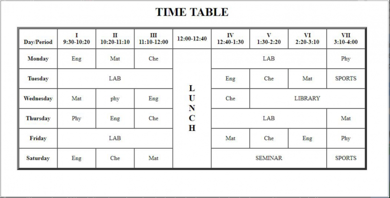
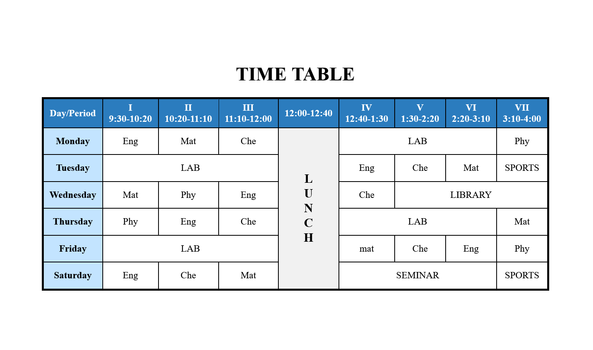

# HTML arrays

[Source code](https://github.com/chriskodehub/KH-9_html-tables)  
[Live demo](https://chriskodehub.github.io/KH-9_html-tables/)

## Oppgave

Create a webpage which shows the table same as in the above picture.
Ref Notes: https://www.w3schools.com/html/html_tables.asp

## Result

